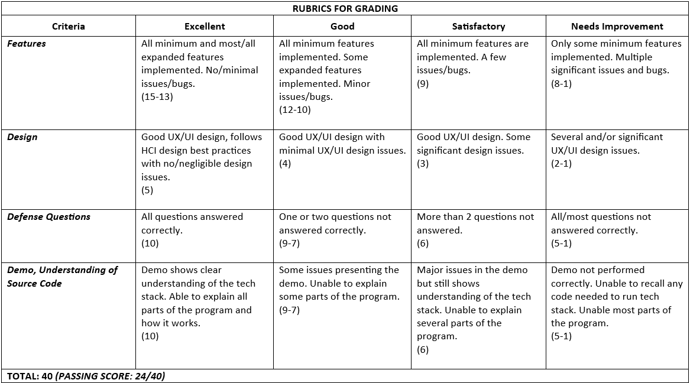

# 🚀 CMSC 129 Laboratory Assign 2 Guide: Laravel MVC CRUD Application

Author: Nikko Gabriel Hismaña

## 📋 Overview

Create a full-stack web application of your choice using the **MVC (Model-View-Controller)** architectural pattern with **Laravel framework**. This lab will help you understand how MVC works in practice using one of the most popular PHP frameworks.

**Tech Stack:**

- **Laravel** (PHP Framework)
- **PostgreSQL** (Relational Database)
- **Blade** (Laravel's templating engine for views)
- **Composer** (PHP dependency manager)

## 🎯 Learning Objectives

- Understand the MVC (Model-View-Controller) architectural pattern
- Learn Laravel framework fundamentals
- Implement CRUD operations with proper MVC separation
- Work with PostgreSQL database and Eloquent ORM
- Master Blade templating engine for dynamic views
- Practice form validation and error handling
- Learn database relationships and migrations
- Understand routing and middleware in Laravel

## ✅ Application Requirements

Before you start, **create a GitHub repository** for your project named **"CMSC129-Lab2-LastNameFNInitials"** (e.g., CMSC129-Lab2-HismanaNG).

### Minimum Requirements

To get the passing score in the Features rubrics, your application must implement the following:

#### 1. CRUD Operations

Your application must have at least **ONE main resource** with full CRUD functionality:

- **Create**: Add new records to the database with form validation
- **Read**: Display/retrieve records (list view and detail view)
- **Update**: Modify existing records with validation
- **Delete**: Remove records from the database (hard delete)

#### 2. MVC Architecture

Your code must properly implement the MVC pattern:

- **Models**: Eloquent models for database interaction
- **Views**: Blade templates for all user interfaces; you can use other templating engines such as Livewire (Vue.js, React, or Svelte not allowed since they are decoupled from Laravel's Blade -- i.e. it would technically be a separate frontend framework, which is not the focus of this lab)
- **Controllers**: Resource controllers handling business logic
- Proper separation of concerns (no business logic in views, no HTML in controllers)

#### 3. Database Requirements

- Use **PostgreSQL** as your database (you could also use Supabase or ElephantSQL for a cloud-based PostgreSQL option)
- Implement proper database migrations
- Use Eloquent ORM for all database operations
- Include at least **5 fields** for your main resource (excluding id and timestamps) [an example of a field in a Todo app could be: title, description, due_date, status, priority]

#### 4. Blade Views

All views must be created using Blade templating engine (but you can use Laravel Livewire for dynamic components if you want). Your views should include:

- Master layout with @yield and @section
- Component reusability (@include or Blade components)
- Form handling with CSRF protection
- Display validation errors properly

#### Non-Functional Requirements

1. **Environment Variables**: Database credentials and sensitive information must be stored in `.env` file and **never committed to GitHub**. Add `.env` to your `.gitignore`.

2. **README.md**: A comprehensive README file must include:
   - Application description and purpose
   - Installation and setup instructions
   - Database setup guide (how to create PostgreSQL database)
   - Migration commands (i.e. `php artisan migrate`)
   - Screenshots of your application
   - List of features implemented
   - MVC architecture explanation (how you structured your models, views, controllers --- you can add your project structure here. WITH COMMENTS ha?)

3. **User Experience**:
   - Responsive design (doesn't have to be mobile-friendly but should look decent on different screen sizes)
   - User-friendly error messages
   - Success/failure feedback for all operations
   - Consistent navigation across pages
   - Just apply what you learned in HCI

### Expanded Requirements

To get a perfect score in the Features Rubrics, implement the three (3) following features:

#### 1. Soft Delete with Restore Functionality

- Implement Laravel's `SoftDeletes` trait in your main model
- Add a "Trash" or "Archived" view to show soft-deleted records
- Provide functionality to:
  - Soft delete records (moves to trash)
  - Restore soft-deleted records
  - Permanently delete records (hard delete from trash)
- Show clear UI indicators for records in trash vs. active records

#### 2a. Search and Filter Functionality

- Implement search across multiple fields of your main resource
- Add at least **two filter options** (e.g., filter by category, status, date range)
- Search should work with pagination
- Clear and intuitive search/filter UI

_**OR** if your application doesn't have suitable fields for search/filter:_

#### 2b. File Upload with Storage Management

- Implement file upload for at least one field (e.g., image, document)
- Requirements:
  - Validate file type and size
  - Store files using Laravel's Storage facade
  - Display uploaded files properly
  - Delete files when record is deleted
  - Update/replace files when edited

#### 3. Database Relationships

- Create at least one additional model with a relationship to your main model (e.g., Category, Tag, Comment)
- This is so you could learn how to use Eloquent relationships (hasOne, hasMany, belongsTo, belongsToMany)
- _I already added an example of this in the sample code below, but you can choose any relationship type (one-to-many, many-to-many, one-to-one)_

#### (OPTIONAL, ungraded) Database Seeding with Faker

- Create database seeders to populate your database with sample data for testing and makes the demo quicker (at least 10 records for your main resource)
- _Again, I already added an example of this in the sample code below, but you can choose any data you want to seed._

_NOTE: You have creative freedom in implementing these expanded requirements. Ensure they work properly during the demo._

---

## 🛠️ Tech Stack Prerequisites

### Required Software

1. **PHP** (v8.1 or higher)
   - **Windows**: [XAMPP](https://www.apachefriends.org/) or [Laragon](https://laragon.org/) (recommended)
   - **Mac**: Use Homebrew: `brew install php`
   - **Linux**: `sudo apt install php php-cli php-mbstring php-xml php-pgsql`
     (kay apparently may ga-Linux daw sa inyo)

2. **Composer** (Dependency Manager for PHP)
   - [Download Composer](https://getcomposer.org/download/)
   - Verify installation: `composer --version`

3. **PostgreSQL** (v12 or higher)
   - [Download PostgreSQL](https://www.postgresql.org/download/)
   - **Alternative**: Use [ElephantSQL](https://www.elephantsql.com/) (free cloud PostgreSQL)
   - Create a database for your project
   - Note your credentials: host, port, database name, username, password

4. **Laravel Installer** (Optional but recommended)

   ```bash
   composer global require laravel/installer
   ```

5. **Node.js and npm** (for asset compilation)
   - [Download Node.js](https://nodejs.org/) (v16.x or higher)
   - Used for Laravel Mix/Vite if you use Tailwind, Bootstrap, etc.

6. **Code Editor**
   - **VS Code** (recommended) - [Download](https://code.visualstudio.com/)
   - **PhpStorm** (professional, requires license)

7. **Git**
   - [Download Git](https://git-scm.com/)

### Useful VS Code Extensions

- **Laravel Extension Pack** by Winnie Lin
- **Laravel Blade Snippets** by Winnie Lin
- **PHP Intelephense**
- **Better Comments**
- **Thunder Client** (for API testing if you add API routes)
- **GitLens** (Git visualization)

### Verifying Your Setup

Run these commands to verify everything is installed correctly:

```bash
php --version        # Should show PHP 8.1+
composer --version   # Should show Composer version
psql --version      # Should show PostgreSQL version
node --version      # Should show Node.js version
npm --version       # Should show npm version
git --version       # Should show Git version
```

---

## 📤 Submission Requirements

### Deliverables

1. **F2F Demo and Defense**. Be prepared to answer questions on:
   - How MVC pattern is implemented in your application
   - The purpose of Models, Views, and Controllers
   - How Eloquent ORM works
   - Blade templating syntax and features
   - Database migrations and relationships
   - Form validation and security (CSRF protection)
   - How routing works in Laravel
   - Soft delete vs hard delete implementation
   - File upload handling

2. **GitHub Repository**. With complete source code and comprehensive Readme.

Refer to our Google Sheet for the deadlines and demo schedule.

## 📊 Rubrics for Grading

### Grading Rubrics

Your project will be evaluated based on the following criteria:



As usual, 30% deduction if late.

## 📁 Project Structure

Laravel follows a standard MVC structure. Here's what you'll be working with:

```
your-laravel-project/
├── app/
│   ├── Http/
│   │   ├── Controllers/      # Your controllers (C in MVC)
│   │   ├── Middleware/       # HTTP middleware
│   │   └── Requests/         # Form request validation
│   ├── Models/               # Your models (M in MVC)
│   └── ...
├── database/
│   ├── migrations/           # Database structure
│   ├── seeders/              # Sample data generators
│   └── factories/            # Model factories for testing
├── public/
│   ├── css/                  # Compiled CSS
│   ├── js/                   # Compiled JavaScript
│   └── images/               # Public images
├── resources/
│   ├── views/                # Your Blade templates (V in MVC)
│   │   ├── layouts/          # Master layouts
│   │   ├── components/       # Reusable components
│   │   └── ...
│   ├── css/                  # Source CSS files
│   └── js/                   # Source JavaScript files
├── routes/
│   ├── web.php               # Web routes (main routes for your app)
│   └── api.php               # API routes
├── storage/
│   ├── app/                  # File uploads
│   ├── logs/                 # Application logs
│   └── framework/            # Framework files
├── tests/                    # Application tests
├── .env                      # Environment variables (NOT in Git or I will kill you)
├── .env.example              # Example environment file
├── composer.json             # PHP dependencies
├── package.json              # Node dependencies
└── README.md                 # Your documentation
```

### Key Directories Explained:

- **app/Models/**: Define your database models (Eloquent ORM)
- **app/Http/Controllers/**: Handle HTTP requests and business logic
- **resources/views/**: Blade templates for HTML rendering
- **database/migrations/**: Version control for database schema
- **routes/web.php**: Define your application routes
- **public/**: Web server root (assets, index.php)

## 🚀 Getting Started Checklist

- [ ] Install PHP
- [ ] Install Composer
- [ ] Install PostgreSQL
- [ ] Install Node.js & npm
- [ ] Install Laravel installer (optional)
- [ ] Install VS Code with extensions
- [ ] Create GitHub repository
- [ ] Create Laravel project
- [ ] Configure `.env` file
- [ ] Create PostgreSQL database
- [ ] Run migrations
- [ ] Start building!

## 💻 Implementation Guide

_Disclaimer: This is a comprehensive step-by-step guide. Adjust based on your specific application requirements._

### Phase 1: Laravel Project Setup

#### Step 1: Create New Laravel Project

Choose one of these methods:

**Method A: Using Laravel Installer (Recommended)**

```bash
laravel new your-project-name
cd your-project-name
```

**Method B: Using Composer**

```bash
composer create-project laravel/laravel your-project-name
cd your-project-name
```

#### Step 2: Configure Environment Variables

Edit the `.env` file in your project root:

```env
APP_NAME="Your Application Name"
APP_ENV=local
APP_DEBUG=true
APP_URL=http://localhost:8000

DB_CONNECTION=pgsql
DB_HOST=127.0.0.1
DB_PORT=5432
DB_DATABASE=your_database_name
DB_USERNAME=your_username
DB_PASSWORD=your_password
```

**Important**: Make sure PostgreSQL is running and you've created the database!

```sql
-- Connect to PostgreSQL and run:
CREATE DATABASE your_database_name;
```

#### Step 3: Test Database Connection

```bash
php artisan migrate
```

If successful, you'll see Laravel's default migrations running. This confirms your database connection works!

#### Step 4: Start Development Server

```bash
php artisan serve
```

Visit `http://localhost:8000` - you should see the Laravel welcome page! 🎉

---

### Phase 2: Building Your MVC Application

<details> <summary>This is basically a sample project, and a lot of it is vibecoded but already tested and working.</summary>

Let's build a sample **Manang Betch Snack House Karenderya Menu System** as an example. Replace "MenuItem" with your chosen resource.

#### Step 1: Create Model, Migration, and Controller

Laravel provides a convenient command to create everything at once:

```bash
php artisan make:model MenuItem -mcr
```

This creates:

- **Model**: `app/Models/MenuItem.php`
- **Migration**: `database/migrations/xxxx_create_menu_items_table.php`
- **Controller**: `app/Http/Controllers/MenuItemController.php` (resource controller)

#### Step 2: Define Database Schema (Migration)

Edit `database/migrations/xxxx_create_menu_items_table.php`:

```php
<?php

use Illuminate\Database\Migrations\Migration;
use Illuminate\Database\Schema\Blueprint;
use Illuminate\Support\Facades\Schema;

return new class extends Migration
{
    public function up(): void
    {
        Schema::create('menu_items', function (Blueprint $table) {
            $table->id();
            $table->string('name');
            $table->text('description')->nullable();
            $table->decimal('full_price', 5, 2); // 5 digits total, 2 decimal places (max 999.99)
            $table->decimal('half_price', 5, 2)->nullable(); // make half price optional (like sa lumpia, wala half price)
            $table->string('image')->nullable();
            $table->boolean('is_available')->default(true);
            $table->timestamps();
            $table->softDeletes(); // For soft delete functionality
        });
    }

    public function down(): void
    {
        Schema::dropIfExists('menu_items');
    }
};
```

**Run the migration:**

```bash
php artisan migrate
```

#### Step 3: Configure Model

Edit `app/Models/MenuItem.php`:

```php
<?php

namespace App\Models;

use Illuminate\Database\Eloquent\Factories\HasFactory;
use Illuminate\Database\Eloquent\Model;
use Illuminate\Database\Eloquent\SoftDeletes;

class MenuItem extends Model
{
    use HasFactory, SoftDeletes;

    /**
     * The attributes that are mass assignable (i.e. can be filled via create/update methods).
     */
    protected $fillable = [
        'name',
        'description',
        'full_price',
        'half_price',
        'image',
        'is_available',
    ];

    /**
     * The attributes that should be cast (i.e. typecast/convert to specific data types).
     */
    protected $casts = [
        'full_price' => 'decimal:2',
        'half_price' => 'decimal:2',
        'is_available' => 'boolean',
    ];
}
```

#### Step 4: Define Routes

Edit `routes/web.php`:

```php
<?php

use Illuminate\Support\Facades\Route;
use App\Http\Controllers\MenuItemController;

Route::get('/', function () {
    return redirect()->route('menu-items.index');
});

// Resource routes for menu items (automatically creates all CRUD routes)
Route::resource('menu-items', MenuItemController::class);

// Additional routes for soft delete functionality (expanded requirements)
Route::get('menu-items/trashed/all', [MenuItemController::class, 'trashed'])->name('menu-items.trashed');
Route::patch('menu-items/{id}/restore', [MenuItemController::class, 'restore'])->name('menu-items.restore');
Route::delete('menu-items/{id}/force-delete', [MenuItemController::class, 'forceDelete'])->name('menu-items.forceDelete');
```

**Resource routes automatically create:**

- `GET /menu-items` → index
- `GET /menu-items/create` → create
- `POST /menu-items` → store
- `GET /menu-items/{id}` → show
- `GET /menu-items/{id}/edit` → edit
- `PUT/PATCH /menu-items/{id}` → update
- `DELETE /menu-items/{id}` → destroy

View all routes: `php artisan route:list`

#### Step 5: Implement Controller Logic

Edit `app/Http/Controllers/MenuItemController.php`:

```php
<?php

namespace App\Http\Controllers;

use App\Models\MenuItem;
use Illuminate\Http\Request;
use Illuminate\Support\Facades\Storage;

class MenuItemController extends Controller
{
    /**
     * Display a listing of menu items.
     */
    public function index(Request $request)
    {
        $query = MenuItem::query();

        // Search functionality
        if ($request->has('search')) {
            $search = $request->search;
            $query->where('name', 'ILIKE', "%{$search}%")
                  ->orWhere('description', 'ILIKE', "%{$search}%");
        }

        // Filter by availability
        if ($request->has('availability') && $request->availability != '') {
            $query->where('is_available', $request->availability);
        }

        // Paginate results
        $menuItems = $query->latest()->paginate(10)->withQueryString();

        return view('menu-items.index', compact('menuItems'));
    }

    /**
     * Show the form for creating a new menu item.
     */
    public function create()
    {
        return view('menu-items.create');
    }

    /**
     * Store a newly created menu item in database.
     */
    public function store(Request $request)
    {
        // Validate input
        $validated = $request->validate([
            'name' => 'required|string|max:255',
            'description' => 'nullable|string',
            'full_price' => 'required|numeric|min:0',
            'half_price' => 'nullable|numeric|min:0|lt:full_price',
            'image' => 'nullable|image|mimes:jpeg,png,jpg,gif|max:2048',
            'is_available' => 'required|boolean',
        ]);

        // Handle file upload
        if ($request->hasFile('image')) {
            $validated['image'] = $request->file('image')->store('menu-items', 'public');
        }

        // Create menu item
        MenuItem::create($validated);

        return redirect()->route('menu-items.index')
                         ->with('success', 'Menu item created successfully!');
    }

    /**
     * Display the specified menu item.
     */
    public function show(MenuItem $menuItem)
    {
        return view('menu-items.show', compact('menuItem'));
    }

    /**
     * Show the form for editing the specified menu item.
     */
    public function edit(MenuItem $menuItem)
    {
        return view('menu-items.edit', compact('menuItem'));
    }

    /**
     * Update the specified menu item in database.
     */
    public function update(Request $request, MenuItem $menuItem)
    {
        // Validate input
        $validated = $request->validate([
            'name' => 'required|string|max:255',
            'description' => 'nullable|string',
            'full_price' => 'required|numeric|min:0',
            'half_price' => 'nullable|numeric|min:0|lt:full_price',
            'image' => 'nullable|image|mimes:jpeg,png,jpg,gif|max:2048',
            'is_available' => 'required|boolean',
        ]);

        // Handle file upload
        if ($request->hasFile('image')) {
            // Delete old image
            if ($menuItem->image) {
                Storage::disk('public')->delete($menuItem->image);
            }
            $validated['image'] = $request->file('image')->store('menu-items', 'public');
        }

        // Update menu item
        $menuItem->update($validated);

        return redirect()->route('menu-items.index')
                         ->with('success', 'Menu item updated successfully!');
    }

    /**
     * Soft delete the specified menu item.
     */
    public function destroy(MenuItem $menuItem)
    {
        $menuItem->delete(); // Soft delete

        return redirect()->route('menu-items.index')
                         ->with('success', 'Menu item moved to trash!');
    }

    /**
     * Display trashed menu items.
     */
    public function trashed()
    {
        $menuItems = MenuItem::onlyTrashed()->latest()->paginate(10);
        return view('menu-items.trashed', compact('menuItems'));
    }

    /**
     * Restore a soft-deleted menu item.
     */
    public function restore($id)
    {
        $menuItem = MenuItem::onlyTrashed()->findOrFail($id);
        $menuItem->restore();

        return redirect()->route('menu-items.trashed')
                         ->with('success', 'Menu item restored successfully!');
    }

    /**
     * Permanently delete a menu item.
     */
    public function forceDelete($id)
    {
        $menuItem = MenuItem::onlyTrashed()->findOrFail($id);

        // Delete image file
        if ($menuItem->image) {
            Storage::disk('public')->delete($menuItem->image);
        }

        $menuItem->forceDelete(); // Permanent delete

        return redirect()->route('menu-items.trashed')
                         ->with('success', 'Menu item permanently deleted!');
    }
}
```

</details>

---

### Phase 3: Creating Blade Views

<details><summary>Again, this is just another mostly-vibe-coded code. </summary>

#### Step 1: Create Master Layout

_I'm using Bootstrap for styling, but you can use Tailwind or any CSS framework you prefer._

Create `resources/views/layouts/app.blade.php`:

```html
<!DOCTYPE html>
<html lang="en">
  <head>
    <meta charset="UTF-8" />
    <meta name="viewport" content="width=device-width, initial-scale=1.0" />
    <title>@yield('title', 'Manang Betch Menu')</title>

    <!-- Bootstrap CSS (or use Tailwind if you prefer) -->
    <link
      href="https://cdn.jsdelivr.net/npm/bootstrap@5.3.0/dist/css/bootstrap.min.css"
      rel="stylesheet"
    />
    <link
      rel="stylesheet"
      href="https://cdnjs.cloudflare.com/ajax/libs/font-awesome/6.4.0/css/all.min.css"
    />

    @stack('styles')
  </head>
  <body>
    <!-- Navigation -->
    <nav class="navbar navbar-expand-lg navbar-dark bg-danger">
      <div class="container">
        <a class="navbar-brand" href="{{ route('menu-items.index') }}">
          <i class="fas fa-utensils"></i> Manang Betch Snack House
        </a>
        <button
          class="navbar-toggler"
          type="button"
          data-bs-toggle="collapse"
          data-bs-target="#navbarNav"
        >
          <span class="navbar-toggler-icon"></span>
        </button>
        <div class="collapse navbar-collapse" id="navbarNav">
          <ul class="navbar-nav ms-auto">
            <li class="nav-item">
              <a class="nav-link" href="{{ route('menu-items.index') }}">
                <i class="fas fa-list"></i> Menu
              </a>
            </li>
            <li class="nav-item">
              <a class="nav-link" href="{{ route('menu-items.create') }}">
                <i class="fas fa-plus"></i> Add Item
              </a>
            </li>
            <li class="nav-item">
              <a class="nav-link" href="{{ route('menu-items.trashed') }}">
                <i class="fas fa-trash"></i> Trash
              </a>
            </li>
          </ul>
        </div>
      </div>
    </nav>

    <!-- Flash Messages -->
    <div class="container mt-3">
      @if(session('success'))
      <div class="alert alert-success alert-dismissible fade show" role="alert">
        <i class="fas fa-check-circle"></i> {{ session('success') }}
        <button
          type="button"
          class="btn-close"
          data-bs-dismiss="alert"
        ></button>
      </div>
      @endif @if(session('error'))
      <div class="alert alert-danger alert-dismissible fade show" role="alert">
        <i class="fas fa-exclamation-circle"></i> {{ session('error') }}
        <button
          type="button"
          class="btn-close"
          data-bs-dismiss="alert"
        ></button>
      </div>
      @endif
    </div>

    <!-- Main Content -->
    <main class="container my-4">@yield('content')</main>

    <!-- Footer -->
    <footer class="bg-danger text-white text-center py-3 mt-5">
      <p class="mb-0">
        &copy; {{ date('Y') }} Manang Betch Snack House Karenderya
      </p>
    </footer>

    <!-- Bootstrap JS -->
    <script src="https://cdn.jsdelivr.net/npm/bootstrap@5.3.0/dist/js/bootstrap.bundle.min.js"></script>
    @stack('scripts')
  </body>
</html>
```

#### Step 2: Create Index View (List All Menu Items)

Create `resources/views/menu-items/index.blade.php`:

```html
@extends('layouts.app')

@section('title', 'Menu Items')

@section('content')
<div class="row">
    <div class="col-md-12">
        <div class="card">
            <div class="card-header bg-danger text-white">
                <h4 class="mb-0"><i class="fas fa-utensils"></i> Menu Items</h4>
            </div>
            <div class="card-body">
                <!-- Search and Filter Form -->
                <form method="GET" action="{{ route('menu-items.index') }}" class="row g-3 mb-4">
                    <div class="col-md-5">
                        <input type="text" name="search" class="form-control"
                               placeholder="Search by name or description..."
                               value="{{ request('search') }}">
                    </div>
                    <div class="col-md-3">
                        <select name="availability" class="form-select">
                            <option value="">All Items</option>
                            <option value="1" {{ request('availability') == '1' ? 'selected' : '' }}>Available</option>
                            <option value="0" {{ request('availability') == '0' ? 'selected' : '' }}>Not Available</option>
                        </select>
                    </div>
                    <div class="col-md-4">
                        <button type="submit" class="btn btn-danger">
                            <i class="fas fa-search"></i> Search
                        </button>
                        <a href="{{ route('menu-items.index') }}" class="btn btn-secondary">
                            <i class="fas fa-redo"></i> Reset
                        </a>
                        <a href="{{ route('menu-items.create') }}" class="btn btn-success">
                            <i class="fas fa-plus"></i> Add New
                        </a>
                    </div>
                </form>

                <!-- Menu Items Table -->
                @if($menuItems->count() > 0)
                    <div class="table-responsive">
                        <table class="table table-striped table-hover">
                            <thead class="table-dark">
                                <tr>
                                    <th>Image</th>
                                    <th>Name</th>
                                    <th>Full Price</th>
                                    <th>Half Price</th>
                                    <th>Availability</th>
                                    <th>Actions</th>
                                </tr>
                            </thead>
                            <tbody>
                                @foreach($menuItems as $item)
                                    <tr>
                                        <td>
                                            @if($item->image)
                                                image) }}"
                                                     alt="{{ $item->name }}"
                                                     class="img-thumbnail"
                                                     style="width: 50px; height: 50px; object-fit: cover;">
                                            @else
                                                <div class="bg-secondary text-white d-flex align-items-center justify-content-center"
                                                     style="width: 50px; height: 50px;">
                                                    <i class="fas fa-image"></i>
                                                </div>
                                            @endif
                                        </td>
                                        <td>{{ $item->name }}</td>
                                        <td>₱{{ number_format($item->full_price, 2) }}</td>
                                        <td>
                                            @if($item->half_price)
                                                ₱{{ number_format($item->half_price, 2) }}
                                            @else
                                                <span class="text-muted">N/A</span>
                                            @endif
                                        </td>
                                        <td>
                                            @if($item->is_available)
                                                <span class="badge bg-success">Available</span>
                                            @else
                                                <span class="badge bg-danger">Not Available</span>
                                            @endif
                                        </td>
                                        <td>
                                            <div class="btn-group" role="group">
                                                <a href="{{ route('menu-items.show', $item) }}"
                                                   class="btn btn-sm btn-info"
                                                   title="View">
                                                    <i class="fas fa-eye"></i>
                                                </a>
                                                <a href="{{ route('menu-items.edit', $item) }}"
                                                   class="btn btn-sm btn-warning"
                                                   title="Edit">
                                                    <i class="fas fa-edit"></i>
                                                </a>
                                                <form action="{{ route('menu-items.destroy', $item) }}"
                                                      method="POST"
                                                      style="display: inline;"
                                                      onsubmit="return confirm('Move this menu item to trash?');">
                                                    @csrf
                                                    @method('DELETE')
                                                    <button type="submit" class="btn btn-sm btn-danger" title="Delete">
                                                        <i class="fas fa-trash"></i>
                                                    </button>
                                                </form>
                                            </div>
                                        </td>
                                    </tr>
                                @endforeach
                            </tbody>
                        </table>
                    </div>

                    <!-- Pagination -->
                    <div class="d-flex justify-content-center">
                        {{ $menuItems->links() }}
                    </div>
                @else
                    <div class="alert alert-info">
                        <i class="fas fa-info-circle"></i> No menu items found.
                    </div>
                @endif
            </div>
        </div>
    </div>
</div>
@endsection
```

#### Step 3: Create Form Views (Create & Edit)

Create `resources/views/menu-items/create.blade.php`:

```html
@extends('layouts.app')

@section('title', 'Add New Menu Item')

@section('content')
<div class="row justify-content-center">
    <div class="col-md-8">
        <div class="card">
            <div class="card-header bg-success text-white">
                <h4 class="mb-0"><i class="fas fa-plus"></i> Add New Menu Item</h4>
            </div>
            <div class="card-body">
                <form action="{{ route('menu-items.store') }}" method="POST" enctype="multipart/form-data">
                    @csrf

                    <div class="mb-3">
                        <label for="name" class="form-label">Dish Name <span class="text-danger">*</span></label>
                        <input type="text"
                               class="form-control @error('name') is-invalid @enderror"
                               id="name"
                               name="name"
                               value="{{ old('name') }}"
                               required>
                        @error('name')
                            <div class="invalid-feedback">{{ $message }}</div>
                        @enderror
                    </div>

                    <div class="mb-3">
                        <label for="description" class="form-label">Description</label>
                        <textarea class="form-control @error('description') is-invalid @enderror"
                                  id="description"
                                  name="description"
                                  rows="4">{{ old('description') }}</textarea>
                        @error('description')
                            <div class="invalid-feedback">{{ $message }}</div>
                        @enderror
                    </div>

                    <div class="row">
                        <div class="col-md-6 mb-3">
                            <label for="full_price" class="form-label">Full Serve Price <span class="text-danger">*</span></label>
                            <div class="input-group">
                                <span class="input-group-text">₱</span>
                                <input type="number"
                                       class="form-control @error('full_price') is-invalid @enderror"
                                       id="full_price"
                                       name="full_price"
                                       value="{{ old('full_price') }}"
                                       step="0.01"
                                       min="0"
                                       required>
                                @error('full_price')
                                    <div class="invalid-feedback">{{ $message }}</div>
                                @enderror
                            </div>
                        </div>

                        <div class="col-md-6 mb-3">
                            <label for="half_price" class="form-label">Half Serve Price</label>
                            <div class="input-group">
                                <span class="input-group-text">₱</span>
                                <input type="number"
                                       class="form-control @error('half_price') is-invalid @enderror"
                                       id="half_price"
                                       name="half_price"
                                       value="{{ old('half_price') }}"
                                       step="0.01"
                                       min="0">
                                @error('half_price')
                                    <div class="invalid-feedback">{{ $message }}</div>
                                @enderror
                            </div>
                            <small class="text-muted">Leave empty if not applicable</small>
                        </div>
                    </div>

                    <div class="mb-3">
                        <label for="is_available" class="form-label">Availability <span class="text-danger">*</span></label>
                        <select class="form-select @error('is_available') is-invalid @enderror"
                                id="is_available"
                                name="is_available"
                                required>
                            <option value="1" {{ old('is_available', 1) == 1 ? 'selected' : '' }}>Available</option>
                            <option value="0" {{ old('is_available') == 0 ? 'selected' : '' }}>Not Available</option>
                        </select>
                        @error('is_available')
                            <div class="invalid-feedback">{{ $message }}</div>
                        @enderror
                    </div>

                    <div class="mb-3">
                        <label for="image" class="form-label">Dish Image</label>
                        <input type="file"
                               class="form-control @error('image') is-invalid @enderror"
                               id="image"
                               name="image"
                               accept="image/*">
                        @error('image')
                            <div class="invalid-feedback">{{ $message }}</div>
                        @enderror
                        <small class="text-muted">Max file size: 2MB. Allowed formats: JPEG, PNG, JPG, GIF</small>
                    </div>

                    <div class="d-flex justify-content-between">
                        <a href="{{ route('menu-items.index') }}" class="btn btn-secondary">
                            <i class="fas fa-arrow-left"></i> Cancel
                        </a>
                        <button type="submit" class="btn btn-success">
                            <i class="fas fa-save"></i> Save Menu Item
                        </button>
                    </div>
                </form>
            </div>
        </div>
    </div>
</div>
@endsection
```

Create `resources/views/menu-items/edit.blade.php`:

```html
@extends('layouts.app')

@section('title', 'Edit Menu Item')

@section('content')
<div class="row justify-content-center">
    <div class="col-md-8">
        <div class="card">
            <div class="card-header bg-warning text-white">
                <h4 class="mb-0"><i class="fas fa-edit"></i> Edit Menu Item</h4>
            </div>
            <div class="card-body">
                <form action="{{ route('menu-items.update', $menuItem) }}" method="POST" enctype="multipart/form-data">
                    @csrf
                    @method('PUT')

                    <div class="mb-3">
                        <label for="name" class="form-label">Dish Name <span class="text-danger">*</span></label>
                        <input type="text"
                               class="form-control @error('name') is-invalid @enderror"
                               id="name"
                               name="name"
                               value="{{ old('name', $menuItem->name) }}"
                               required>
                        @error('name')
                            <div class="invalid-feedback">{{ $message }}</div>
                        @enderror
                    </div>

                    <div class="mb-3">
                        <label for="description" class="form-label">Description</label>
                        <textarea class="form-control @error('description') is-invalid @enderror"
                                  id="description"
                                  name="description"
                                  rows="4">{{ old('description', $menuItem->description) }}</textarea>
                        @error('description')
                            <div class="invalid-feedback">{{ $message }}</div>
                        @enderror
                    </div>

                    <div class="row">
                        <div class="col-md-6 mb-3">
                            <label for="full_price" class="form-label">Full Serve Price <span class="text-danger">*</span></label>
                            <div class="input-group">
                                <span class="input-group-text">₱</span>
                                <input type="number"
                                       class="form-control @error('full_price') is-invalid @enderror"
                                       id="full_price"
                                       name="full_price"
                                       value="{{ old('full_price', $menuItem->full_price) }}"
                                       step="0.01"
                                       min="0"
                                       required>
                                @error('full_price')
                                    <div class="invalid-feedback">{{ $message }}</div>
                                @enderror
                            </div>
                        </div>

                        <div class="col-md-6 mb-3">
                            <label for="half_price" class="form-label">Half Serve Price</label>
                            <div class="input-group">
                                <span class="input-group-text">₱</span>
                                <input type="number"
                                       class="form-control @error('half_price') is-invalid @enderror"
                                       id="half_price"
                                       name="half_price"
                                       value="{{ old('half_price', $menuItem->half_price) }}"
                                       step="0.01"
                                       min="0">
                                @error('half_price')
                                    <div class="invalid-feedback">{{ $message }}</div>
                                @enderror
                            </div>
                            <small class="text-muted">Leave empty if not applicable</small>
                        </div>
                    </div>

                    <div class="mb-3">
                        <label for="is_available" class="form-label">Availability <span class="text-danger">*</span></label>
                        <select class="form-select @error('is_available') is-invalid @enderror"
                                id="is_available"
                                name="is_available"
                                required>
                            <option value="1" {{ old('is_available', $menuItem->is_available) == 1 ? 'selected' : '' }}>Available</option>
                            <option value="0" {{ old('is_available', $menuItem->is_available) == 0 ? 'selected' : '' }}>Not Available</option>
                        </select>
                        @error('is_available')
                            <div class="invalid-feedback">{{ $message }}</div>
                        @enderror
                    </div>

                    <div class="mb-3">
                        <label for="image" class="form-label">Dish Image</label>

                        @if($menuItem->image)
                            <div class="mb-2">
                                image) }}"
                                     alt="{{ $menuItem->name }}"
                                     class="img-thumbnail"
                                     style="max-width: 200px;">
                                <p class="text-muted small">Current image</p>
                            </div>
                        @endif

                        <input type="file"
                               class="form-control @error('image') is-invalid @enderror"
                               id="image"
                               name="image"
                               accept="image/*">
                        @error('image')
                            <div class="invalid-feedback">{{ $message }}</div>
                        @enderror
                        <small class="text-muted">Leave empty to keep current image. Max: 2MB. Formats: JPEG, PNG, JPG, GIF</small>
                    </div>

                    <div class="d-flex justify-content-between">
                        <a href="{{ route('menu-items.index') }}" class="btn btn-secondary">
                            <i class="fas fa-arrow-left"></i> Cancel
                        </a>
                        <button type="submit" class="btn btn-warning">
                            <i class="fas fa-save"></i> Update Menu Item
                        </button>
                    </div>
                </form>
            </div>
        </div>
    </div>
</div>
@endsection
```

#### Step 4: Create Show View (View Single Menu Item)

Create `resources/views/menu-items/show.blade.php`:

```html
@extends('layouts.app') @section('title', 'Menu Item Details')
@section('content')
<div class="row justify-content-center">
  <div class="col-md-8">
    <div class="card">
      <div class="card-header bg-info text-white">
        <h4 class="mb-0"><i class="fas fa-eye"></i> Menu Item Details</h4>
      </div>
      <div class="card-body">
        <div class="row">
          <div class="col-md-4 text-center mb-3">
            @if($menuItem->image)
            image) }}"
              alt="{{ $menuItem->name }}"
              class="img-fluid rounded border"
            />
            @else
            <div
              class="bg-secondary text-white d-flex align-items-center justify-content-center rounded"
              style="height: 250px;"
            >
              <i class="fas fa-image fa-5x"></i>
            </div>
            @endif
          </div>
          <div class="col-md-8">
            <table class="table table-bordered">
              <tr>
                <th width="35%">Dish Name</th>
                <td>{{ $menuItem->name }}</td>
              </tr>
              <tr>
                <th>Full Serve Price</th>
                <td class="text-success fw-bold">
                  ₱{{ number_format($menuItem->full_price, 2) }}
                </td>
              </tr>
              <tr>
                <th>Half Serve Price</th>
                <td class="text-success fw-bold">
                  @if($menuItem->half_price) ₱{{
                  number_format($menuItem->half_price, 2) }} @else
                  <span class="text-muted">Not Available</span>
                  @endif
                </td>
              </tr>
              <tr>
                <th>Availability</th>
                <td>
                  @if($menuItem->is_available)
                  <span class="badge bg-success">Available</span>
                  @else
                  <span class="badge bg-danger">Not Available</span>
                  @endif
                </td>
              </tr>
              <tr>
                <th>Created At</th>
                <td>{{ $menuItem->created_at->format('M d, Y h:i A') }}</td>
              </tr>
              <tr>
                <th>Updated At</th>
                <td>{{ $menuItem->updated_at->format('M d, Y h:i A') }}</td>
              </tr>
            </table>

            @if($menuItem->description)
            <div class="mt-3">
              <h5>Description:</h5>
              <p>{{ $menuItem->description }}</p>
            </div>
            @endif
          </div>
        </div>

        <div class="d-flex justify-content-between mt-4">
          <a href="{{ route('menu-items.index') }}" class="btn btn-secondary">
            <i class="fas fa-arrow-left"></i> Back to Menu
          </a>
          <div>
            <a
              href="{{ route('menu-items.edit', $menuItem) }}"
              class="btn btn-warning"
            >
              <i class="fas fa-edit"></i> Edit
            </a>
            <form
              action="{{ route('menu-items.destroy', $menuItem) }}"
              method="POST"
              style="display: inline;"
              onsubmit="return confirm('Move this menu item to trash?');"
            >
              @csrf @method('DELETE')
              <button type="submit" class="btn btn-danger">
                <i class="fas fa-trash"></i> Delete
              </button>
            </form>
          </div>
        </div>
      </div>
    </div>
  </div>
</div>
@endsection
```

#### Step 5: Create Trash View (Soft Deleted Items)

Create `resources/views/menu-items/trashed.blade.php`:

```php
@extends('layouts.app')

@section('title', 'Trashed Menu Items')

@section('content')
<div class="row">
    <div class="col-md-12">
        <div class="card">
            <div class="card-header bg-danger text-white">
                <h4 class="mb-0"><i class="fas fa-trash"></i> Trashed Menu Items</h4>
            </div>
            <div class="card-body">
                @if($menuItems->count() > 0)
                    <div class="alert alert-warning">
                        <i class="fas fa-info-circle"></i> These menu items have been soft-deleted. You can restore or permanently delete them.
                    </div>

                    <div class="table-responsive">
                        <table class="table table-striped table-hover">
                            <thead class="table-dark">
                                <tr>
                                    <th>Name</th>
                                    <th>Full Price</th>
                                    <th>Half Price</th>
                                    <th>Deleted At</th>
                                    <th>Actions</th>
                                </tr>
                            </thead>
                            <tbody>
                                @foreach($menuItems as $item)
                                    <tr>
                                        <td>{{ $item->name }}</td>
                                        <td>₱{{ number_format($item->full_price, 2) }}</td>
                                        <td>
                                            @if($item->half_price)
                                                ₱{{ number_format($item->half_price, 2) }}
                                            @else
                                                <span class="text-muted">N/A</span>
                                            @endif
                                        </td>
                                        <td>{{ $item->deleted_at->format('M d, Y h:i A') }}</td>
                                        <td>
                                            <form action="{{ route('menu-items.restore', $item->id) }}"
                                                  method="POST"
                                                  style="display: inline;">
                                                @csrf
                                                @method('PATCH')
                                                <button type="submit"
                                                        class="btn btn-sm btn-success"
                                                        title="Restore">
                                                    <i class="fas fa-undo"></i> Restore
                                                </button>
                                            </form>

                                            <form action="{{ route('menu-items.forceDelete', $item->id) }}"
                                                  method="POST"
                                                  style="display: inline;"
                                                  onsubmit="return confirm('Permanently delete this menu item? This action cannot be undone!');">
                                                @csrf
                                                @method('DELETE')
                                                <button type="submit"
                                                        class="btn btn-sm btn-danger"
                                                        title="Permanently Delete">
                                                    <i class="fas fa-times"></i> Delete Forever
                                                </button>
                                            </form>
                                        </td>
                                    </tr>
                                @endforeach
                            </tbody>
                        </table>
                    </div>

                    <!-- Pagination -->
                    <div class="d-flex justify-content-center">
                        {{ $menuItems->links() }}
                    </div>
                @else
                    <div class="alert alert-info">
                        <i class="fas fa-info-circle"></i> Trash is empty. No deleted menu items found.
                    </div>
                @endif

                <div class="mt-3">
                    <a href="{{ route('menu-items.index') }}" class="btn btn-secondary">
                        <i class="fas fa-arrow-left"></i> Back to Menu
                    </a>
                </div>
            </div>
        </div>
    </div>
</div>
@endsection
```

</details>

---

### Phase 4: Setting Up File Storage

<details>
<summary>Click to expand</summary>

Laravel needs to create a symbolic link from `public/storage` to `storage/app/public` for file uploads to work:

```bash
php artisan storage:link
```

This command creates a symbolic link so uploaded files in `storage/app/public` are accessible from the web.

</details>

---

### Phase 5: Database Seeding (Optional but Recommended)

<details>
<summary>This is optional as stated in the requirements</summary>

Database Seeding allows you to populate your database with **sample data** for testing and development.

#### Step 1: Create Factory

Edit `database/factories/MenuItemFactory.php` (create if doesn't exist):

```php
<?php

namespace Database\Factories;

use Illuminate\Database\Eloquent\Factories\Factory;

class MenuItemFactory extends Factory
{
    public function definition(): array
    {
        $dishes = [
            'Adobo Manok', 'Lumpia', 'Kare-Kare', 'Bicol Express Chicken', 'Pakbet',
            'Sisig', 'Bulalo', 'Dinuguan',
            'Pancit Canton', 'Lumpiang Shanghai', 'Fried Chicken', 'Pork BBQ nga tig-a2x'
        ];

        $fullPrice = $this->faker->randomFloat(2, 50, 200);
        $halfPrice = $this->faker->boolean(70) ? $fullPrice * 0.6 : null;

        return [
            'name' => $this->faker->randomElement($dishes),
            'description' => $this->faker->sentence(8),
            'full_price' => $fullPrice,
            'half_price' => $halfPrice,
            'is_available' => $this->faker->boolean(85),
        ];
    }
}
```

#### Step 2: Create Seeder

Create a seeder:

```bash
php artisan make:seeder MenuItemSeeder
```

Edit `database/seeders/MenuItemSeeder.php`:

```php
<?php

namespace Database\Seeders;

use App\Models\MenuItem;
use Illuminate\Database\Seeder;

class MenuItemSeeder extends Seeder
{
    public function run(): void
    {
        MenuItem::factory()->count(20)->create();
    }
}
```

Edit `database/seeders/DatabaseSeeder.php`:

```php
<?php

namespace Database\Seeders;

use Illuminate\Database\Seeder;

class DatabaseSeeder extends Seeder
{
    public function run(): void
    {
        $this->call([
            MenuItemSeeder::class,
        ]);
    }
}
```

#### Step 3: Run Seeder

```bash
php artisan db:seed
```

Or refresh database and seed:

```bash
php artisan migrate:fresh --seed
```

</details>

---

### Phase 6: Adding Relationships (for your Expanded Requirements)

<details>
<summary>Click to expand</summary>

This part is about adding a **Category** model with a one-to-many relationship (One category has many products). The purpose of this exercise is to demonstrate how to implement database relationships in Laravel using Eloquent ORM.

#### Step 1: Create Category Model, Migration, Controller

```bash
php artisan make:model Category -mcr
```

#### Step 2: Define Category Migration

Edit `database/migrations/xxxx_create_categories_table.php`:

```php
<?php

use Illuminate\Database\Migrations\Migration;
use Illuminate\Database\Schema\Blueprint;
use Illuminate\Support\Facades\Schema;

return new class extends Migration
{
    public function up(): void
    {
        Schema::create('categories', function (Blueprint $table) {
            $table->id();
            $table->string('name')->unique();
            $table->text('description')->nullable();
            $table->timestamps();
        });
    }

    public function down(): void
    {
        Schema::dropIfExists('categories');
    }
};
```

#### Step 3: Add Foreign Key to Products

Create a new migration:

```bash
php artisan make:migration add_category_id_to_products_table
```

Edit the new migration file:

```php
<?php

use Illuminate\Database\Migrations\Migration;
use Illuminate\Database\Schema\Blueprint;
use Illuminate\Support\Facades\Schema;

return new class extends Migration
{
    public function up(): void
    {
        Schema::table('products', function (Blueprint $table) {
            $table->foreignId('category_id')->nullable()->constrained()->onDelete('set null');
        });
    }

    public function down(): void
    {
        Schema::table('products', function (Blueprint $table) {
            $table->dropForeign(['category_id']);
            $table->dropColumn('category_id');
        });
    }
};
```

Run migrations:

```bash
php artisan migrate
```

#### Step 4: Define Relationships in Models

Edit `app/Models/Category.php`:

```php
<?php

namespace App\Models;

use Illuminate\Database\Eloquent\Factories\HasFactory;
use Illuminate\Database\Eloquent\Model;

class Category extends Model
{
    use HasFactory;

    protected $fillable = ['name', 'description'];

    /**
     * Get the products for the category.
     */
    public function products()
    {
        return $this->hasMany(Product::class);
    }
}
```

Edit `app/Models/Product.php` (add category relationship):

```php
protected $fillable = [
    'name',
    'description',
    'price',
    'quantity',
    'sku',
    'image',
    'status',
    'category_id', // Add this
];

/**
 * Get the category that owns the product.
 */
public function category()
{
    return $this->belongsTo(Category::class);
}
```

---

#### Step 5: Update Controller and Views

In your `ProductController`, update the `index` method to include category filter, and update form views to include category dropdown.

</details>

---

## 📚 Helpful Resources

### Official Documentation

- [Laravel Documentation](https://laravel.com/docs) - **Start here!**
- [Laravel Blade Templates](https://laravel.com/docs/blade)
- [Laravel Eloquent ORM](https://laravel.com/docs/eloquent)
- [Laravel Validation](https://laravel.com/docs/validation)
- [Laravel File Storage](https://laravel.com/docs/filesystem)
- [PostgreSQL Documentation](https://www.postgresql.org/docs/)

### Video Tutorials

- [Laravel 11 Crash Course](https://www.youtube.com/watch?v=eUNWzJUvkCA) (YouTube)
- [Laravel Tutorial For Beginners (Simple User CRUD App)](https://www.youtube.com/watch?v=cDEVWbz2PpQ)(YouTube) - Some parts may be outdated/deprecated, but still useful for understanding basic CRUD operations.

### Learning Platforms

- [Laracasts](https://laracasts.com/) - Premium Laravel screencasts (some free content --- thank you Cedric for showing this resource)
- [Laravel Bootcamp](https://bootcamp.laravel.com/) - Official Laravel tutorial

### Tools & Resources

- [Spatie Packages](https://spatie.be/open-source/packages) - High-quality Laravel packages
- [Laravel Cheat Sheet](https://learntheweb.courses/topics/laravel-cheat-sheet/)
- [TablePlus](https://tableplus.com/) - PostgreSQL GUI client
- [pgAdmin](https://www.pgadmin.org/) - Free PostgreSQL management tool

### Common Issues & Solutions

This is just some of the common issues I encountered when setting up Laravel for the first time.

#### Issue 1: "No application encryption key has been set"

```bash
php artisan key:generate
```

#### Issue 2: Image uploads not working

```bash
php artisan storage:link
```

#### Issue 3: Permission errors (Linux/Mac)

```bash
chmod -R 775 storage bootstrap/cache
```

#### Issue 4: PostgreSQL connection refused

- Check if PostgreSQL is running
- Verify credentials in `.env` file
- Check port number (default: 5432)

#### Issue 5: Class not found after creating new file

```bash
composer dump-autoload
```

## 💬 Support

If you encounter issues:

1. Check the Laravel documentation
2. Read error messages carefully (Laravel has descriptive errors)
3. Check Laravel logs in `storage/logs/laravel.log`
4. Search Stack Overflow for similar problems
5. Contact classmates for help
6. Ask the instructor during office hours
7. Use AI tools (ChatGPT, Claude) for coding assistance - but understand the code!

---
